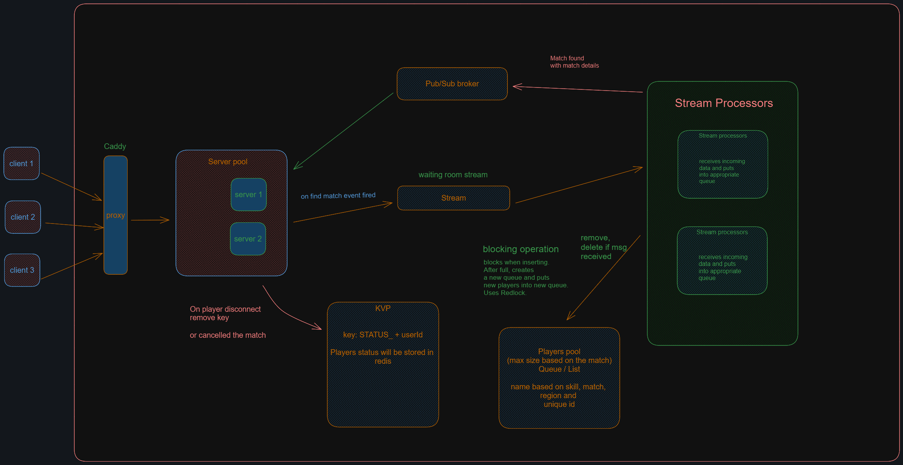

# Distributed Match maker & Lobby system

A Distributed cluster-mode Match maker system implemented in NodeJs that can operate at scale and supports any number of nodes(machines) [TESTED in 10-12 Docker containers, and works like a charm].

## Servers

There are 2 projects coupled in [backend folder](/backend/). One is Websocket layer where users can interact with, and Second is Stream processor which does all the heavy work (Matching, Adding to pool, Setting User status, Creating Matches).

## Client

[client side project](/frontend/) coded in React, which just acts as a simple interface to interact with the servers (Connecting, Searching a match, Cancel searching, Disconnecting).

## TODO:

-   [x] Fully functional Distributed Match-maker cluster.
-   [ ] Clean code (under beta stage).
-   [ ] Container orchestractor with token generator.
-   [ ] Lobby System.
-   [ ] Actual game to play with.

## Why make a Match maker

I am interested in all things related to multiplayer games and game development stuff and wanted to try out how games match-maker works under the hood. I started researching about this topic, but the resources I was able to find was very little. As no one really talks about their In-House tech and architecture. But I tried my best to implement a match maker in a distributed fashion.

## Tech Stacks

-   NodeJs
-   Socket.io
-   Nats (Streaming & Pub/Sub)
-   Redis
-   Docker

# High level Architecture overview

# Instructions to run

-   Spin up the [docker compose file](/ops/backend/docker-compose.yml)
-   Open browser and navigate to [localhost:5173](http://localhost:5173)
-   Create multiple tabs of the same frontend client to simulate multiple users.
-   click on `Connect` button to connect to the server using websocket(socket.io).
-   Select whatever (profile) settings you want and press Find a match.
-   Once 4 player start a match with the same config, all of them will get a message saying match found.

# References

-   Nats [Youtube playlist](https://www.youtube.com/playlist?list=PLgqCaaYodvKZ0JDTEOryCoJDeLVNvMWpj) to lear about it. It is an alternative to Kafka with simplicity, written in Go. [NodeJs library](https://github.com/nats-io/nats.js) used for this project.
-   Redis Distributed Locks post by [Martin kleppmann](https://martin.kleppmann.com/2016/02/08/how-to-do-distributed-locking.html).
-   Call Of Duty's match maker [reference](https://www.callofduty.com/blog/2024/01/call-of-duty-update-an-Inside-look-at-matchmaking).
-   A conference [talk at GDC](https://youtu.be/-pglxege-gU?si=V-Ppl8sHpnYqakmy) about match-making based on skills, ranking and latency.
-   [Redis commands](https://redis.io/docs/latest/commands/).
-   Researching how distributed systems operate.
